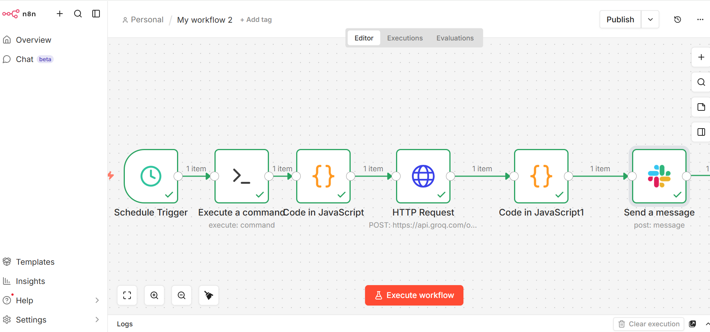
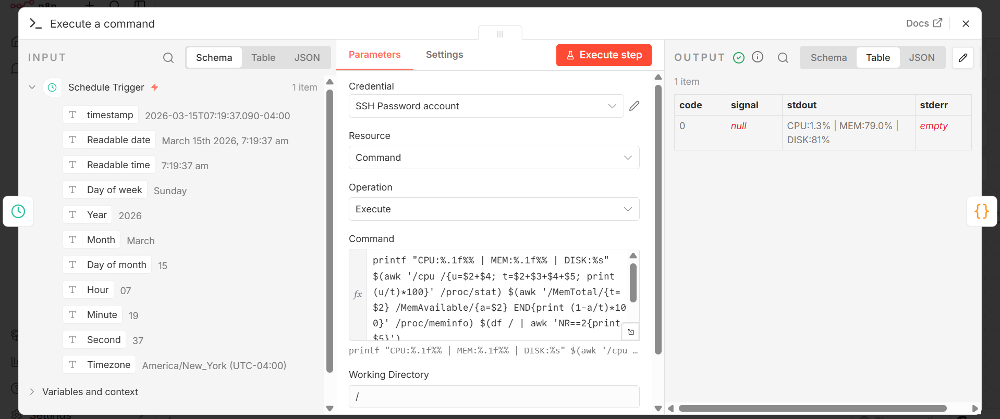
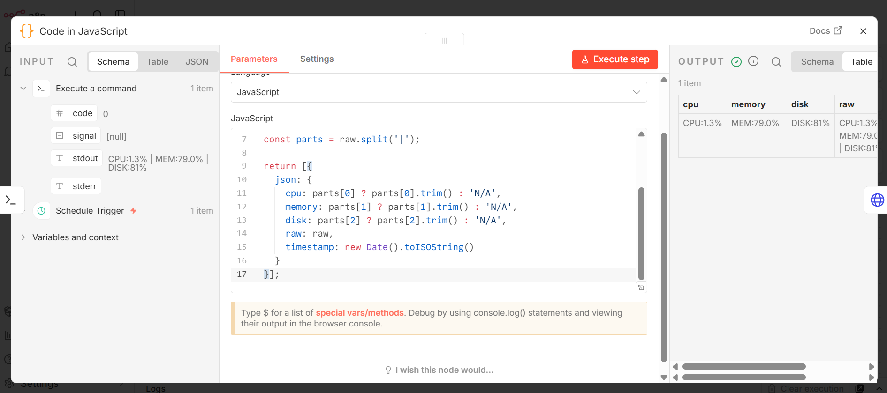
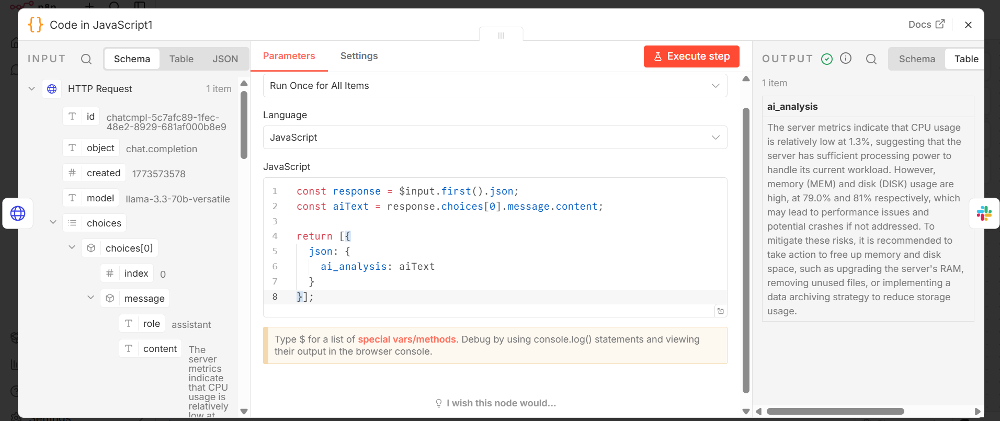
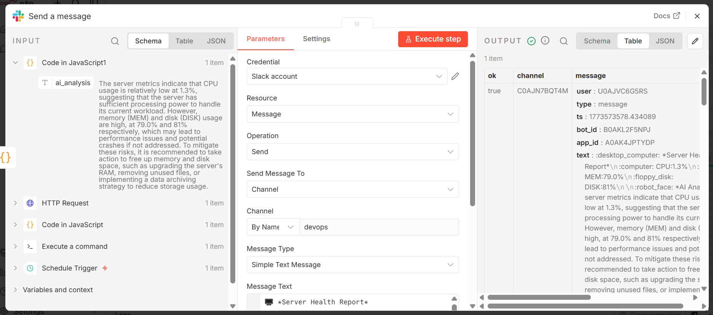
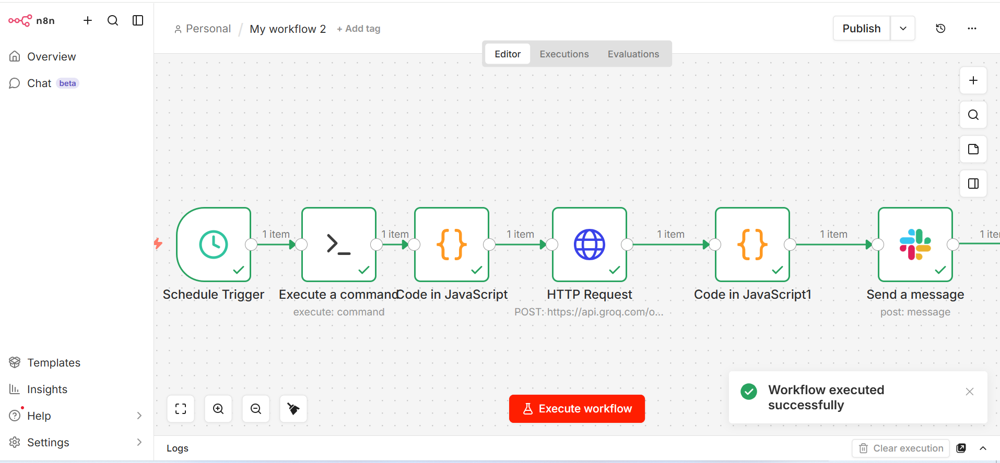
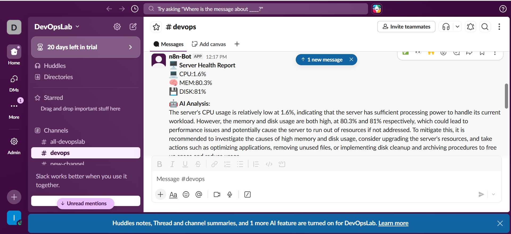

# AI-Powered Server Health Monitor 🖥️


## Overview
This project monitors the health of an AWS EC2 server every 5 minutes using 
an automated n8n workflow. It collects CPU, memory and disk usage metrics via 
SSH, passes them through a Groq LLaMA AI model for intelligent analysis, and 
sends a detailed report with AI recommendations to Slack. This reduces mean 
time to detection (MTTD) for server performance issues and eliminates manual 
monitoring.

---

## Architecture


---

## Tech Stack
| Tool | Purpose |
|------|---------|
| n8n | Workflow automation engine |
| AWS EC2 | Server being monitored |
| SSH Node | Collects server metrics remotely |
| Groq LLaMA 3.3 70b | AI analysis of server metrics |
| Slack API | Real-time alert delivery |

---

## How It Works
1. **Schedule Trigger** fires every 5 minutes automatically
2. **SSH Node** connects to EC2 and runs bash commands to collect CPU, memory and disk usage
3. **Code Node** formats the raw metrics into clean structured data
4. **HTTP Request Node** sends metrics to Groq LLaMA AI for intelligent analysis
5. **Code Node** extracts the AI analysis text from the response
6. **Slack Node** sends a complete health report with metrics and AI recommendations

---

## Features
- Monitors CPU, memory and disk usage every 5 minutes
- Uses AI to interpret metrics and suggest actions
- Sends human-readable Slack alerts instead of raw numbers
- Flags high memory and disk usage before they cause outages
- Fully automated with zero manual intervention required

---

## Screenshots

### Full Workflow Canvas


### Schedule Node


### SSH Node


### Code Node - Metrics Formatter


### HTTP Request Node - Groq AI


### Code Node - AI Extraction


### Slack Node


### Successful Test Run


### Slack Alert Received


---

## Sample AI Analysis Output
> "The server's CPU usage is relatively low at 1.6%, indicating sufficient 
> processing power. However memory and disk usage are both high at 80.3% and 
> 81% respectively, which could lead to performance issues. It is recommended 
> to investigate the causes of high memory and disk usage and consider 
> implementing disk cleanup procedures."

---

## How to Run This Project
1. Clone this repo
2. Import `workflow.json` into your n8n instance
3. Add your SSH credentials for your EC2 instance
4. Add your Groq API key in the HTTP Request node headers
5. Add your Slack credentials in the Slack node
6. Update the channel name in the Slack node
7. Activate the workflow

---

## Lessons Learned
- Learned how to connect to a remote EC2 server using SSH directly from n8n
- Discovered that bash commands need to be carefully formatted to return 
  clean single-line output for downstream processing
- Learned how to call an external AI API using the HTTP Request node with 
  Bearer token authentication
- Understood how to extract nested JSON response data using a Code node
- Learned that Groq's free tier has no quota issues making it ideal for 
  automated workflows

---

## Author
Isaac Ambi — DevOps Engineer
[GitHub](https://github.com/isaacambi) |
[LinkedIn](https://www.linkedin.com/in/isaac-ambi-012b75135/?lipi=urn%3Ali%3Apage%3Ad_flagship3_profile_view_base_contact_details%3BIIaVOHSyRaK%2BapwAVwzaUA%3D%3D)
```

---

### Step 26 — Commit Your README
Scroll down and click **"Commit changes"** → **"Commit changes"**

---


[paste your repo link]

#DevOps #Automation #AI #n8n #AWS #Groq
